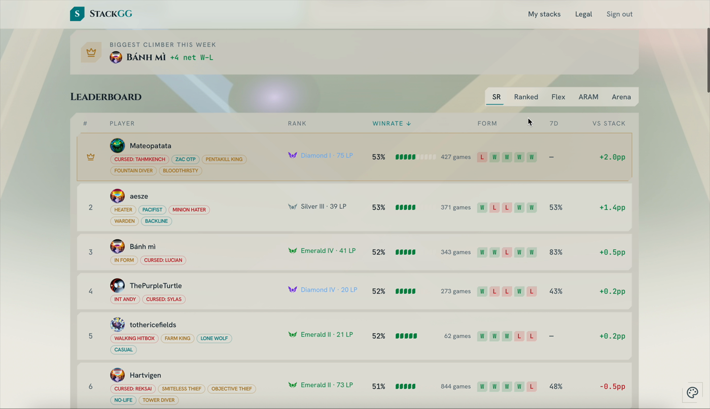
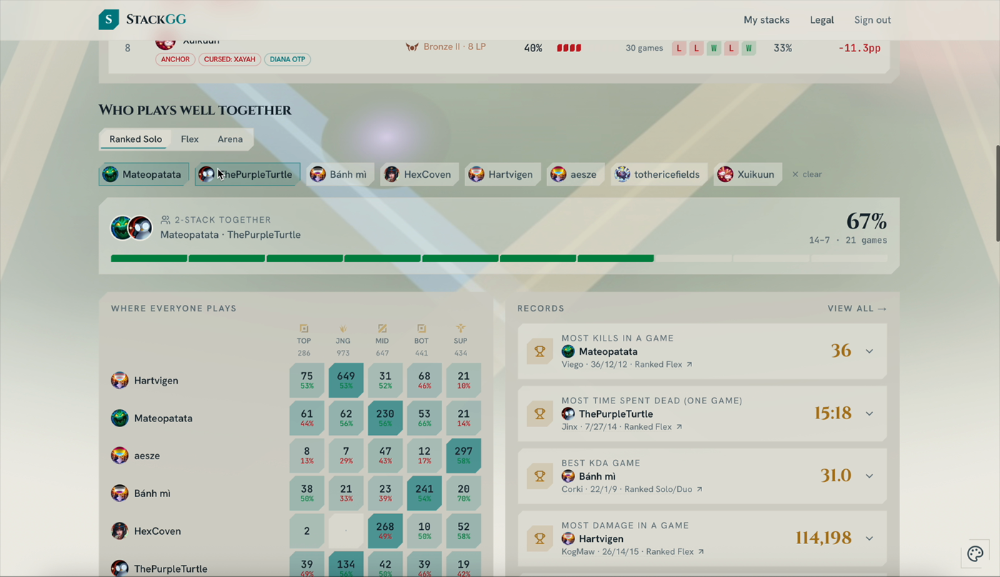
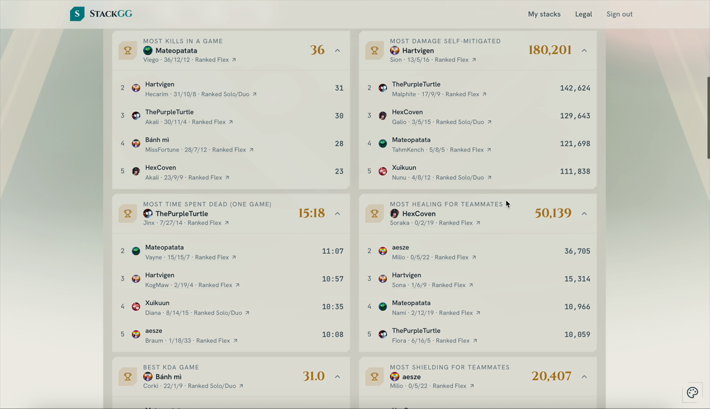
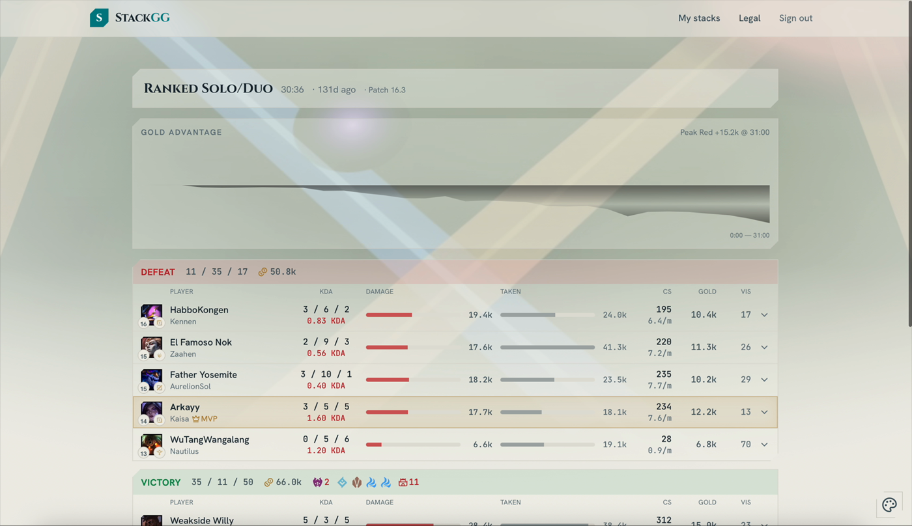
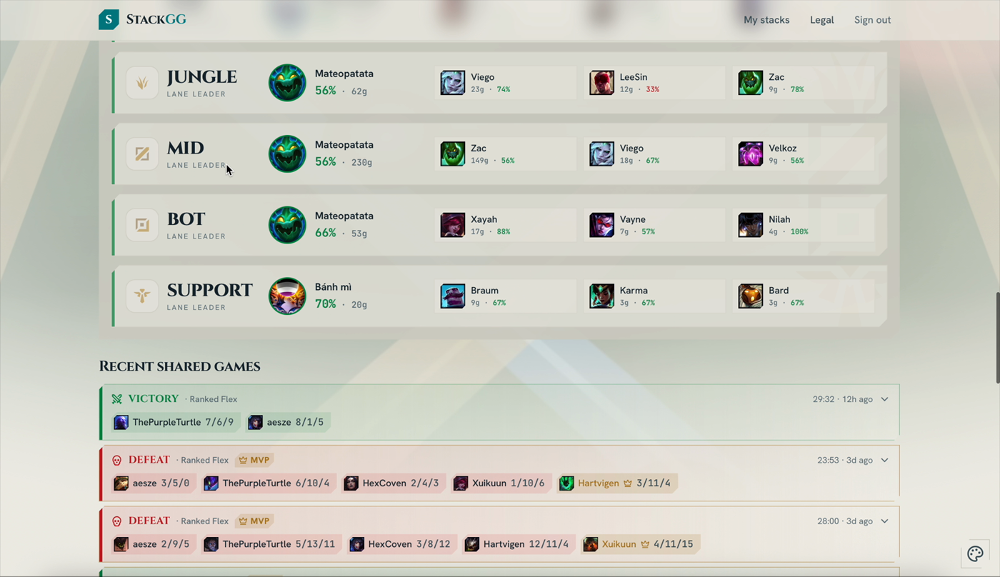

# StackGG

**Live at [stackgg.app](https://stackgg.app)**

> *op.gg tells you how **you** play. StackGG tells you how your **group** plays together.*

A League of Legends stats site for friend groups. Any crew of friends creates a shared
**stack page** — a cross-mode leaderboard, duo-synergy winrates, per-player records and
playstyle tags, and a full match scoreboard — all computed *across the group*, not per player.

<p align="center">
  
</p>

## The idea

League is mostly played in friend groups that live on Discord — but every major stats site
(op.gg, u.gg, mobalytics) models the *individual player*. None of them answer the questions
friend groups actually argue about:

- Who's the best among us, across ranked, flex, ARAM, **and** Arena?
- Which duo actually wins together — and which one should stop queueing together?
- Who holds the records — most kills in a game, best KDA, the longest game we ever won?

StackGG answers exactly these. You sign up, create a stack, drop an invite link in your
Discord, and the site continuously ingests everyone's match history from the Riot API —
computing stats that only exist *across* the group.

## A look inside

**Cross-mode leaderboard** — ranked / flex / ARAM / Arena in one view, with recent form,
crew-relative "vs stack" deltas, and playstyle tags earned from real games.



**Duo synergy** — best and worst pairings by shared-game winrate (hidden below 3 games), plus
a "who plays where" role heatmap for the whole crew.



**Records & awards** — per-game bests, all-time totals, and per-minute rates across the stack.



**In-depth match page** — full scoreboard, gold graph, per-player KDA/damage/vision, and an
"in your stack" flag on every game.



**Lane leaders** — who owns each role in the crew, with their best champions.



## Why this space is genuinely empty

1. **Wrong unit of analysis for incumbents.** Their data models, UIs, and monetization are
   built around individuals. Group-relative stats ("you're the worst Jinx in the crew") and
   team-as-unit analytics don't fit their architecture or their business.
2. **Distribution is built in.** A crew page is useless alone — every user must invite friends
   to unlock it, and the invite link naturally lands in a Discord server.
3. **Riot's own policy hollowed out Arena coverage.** Third parties are banned from showing win
   rates for Arena augments/items — what a *builds* site would build. StackGG computes stats
   about *players and duos*, which is fully allowed. The mode incumbents neglect is wide open.
4. **ARAM/Arena are data-rich but product-poor.** The match-v5 API returns full participant
   data for both; sites ignore them for business reasons, not technical ones.

## How it works

A Next.js 15 + TypeScript monorepo over Postgres:

- **`apps/web`** — the Next.js App Router frontend (dashboard, records, match, player pages),
  plus an animated three.js "Rift" background and a dark data-dense theme system.
- **`apps/worker`** — a long-running ingestion service. Backfills 90 days of history on join
  and polls every ~30 min, deduplicating shared games (the norm for a friend group).
- **`packages/shared`** — zod contracts, DB types, fixtures, and the single rate-limited
  `RiotClient`. Every Riot call goes through a **Postgres-coordinated token bucket**
  (20 req/s · 100 req/2min) so limits hold *globally* across web and worker. These are the
  limits of a **personal API key** (non-expiring, dev-tier); a Riot production-key application
  is in progress.
- **`packages/stats`** — pure stat computations (leaderboard, synergy, records, tags): DB rows
  in, numbers out, unit-tested against fixtures with hand-computed expected values.

Auth is a self-contained email magic-link (HMAC-signed session cookie, no external SMTP
required in dev). Membership is claim-by-Riot-ID — all displayed data is public match data, the
same basis op.gg operates on. Queues covered: 420 solo, 440 flex, 450 ARAM, 1700 Arena.

> Naming note: the product calls a friend group a *stack*; the code and database still call it a
> *crew* (`@crewstats/*` packages, `crews` / `crew_members` tables). Same concept — the rename
> was intentionally left partial to avoid churn.

## Roadmap

| Milestone | Scope | Status |
|---|---|---|
| M1 skeleton | Monorepo scaffold, schema, shared contracts, rate-limited Riot client, backfill job | ✅ done |
| M2 crew core | Auth, crew create / join / invite, dashboard with real data | ✅ done |
| M3 polish | Player snapshot, records / awards, flex role stats, playstyle tags, match page | ✅ done |
| M4 public | Deploy, legal disclaimer, personal API key, share beyond friends | ✅ live at [stackgg.app](https://stackgg.app) |
| v2 | Discord webhook digest → bot, RSO login, crew-vs-crew, other Riot titles | planned |

## Running locally

```bash
npm install
cp .env.example .env            # then set RIOT_KEY (and AUTH_SECRET for prod)
createdb crewstats              # local Postgres
npm run db:migrate
./scripts/dev.sh                # runs the worker + web together
# open http://localhost:3000
```

Then enter a Riot ID on the landing page for a snapshot, or **Create a stack** (magic-link
sign-in — in dev the link is printed to the server console), share the `/join/<code>` link, and
watch the dashboard fill in.

- **Docker** (Postgres + web + worker in one project): `docker compose up --build`
- **Tests:** `npm test` &nbsp;·&nbsp; **Typecheck:** `npm run typecheck`
- **Deploy:** `Dockerfile` + `docker-compose.yml` are provided; see [`DEPLOY.md`](./DEPLOY.md)
  for the Railway/Fly walkthrough.

Requires Node 18+ and a local Postgres. Config lives in `.env` — see
[`.env.example`](./.env.example).

## Legal

StackGG isn't endorsed by Riot Games and doesn't reflect the views or opinions of Riot Games or
anyone officially involved in producing or managing Riot Games properties. Riot Games and League
of Legends are trademarks or registered trademarks of Riot Games, Inc.
